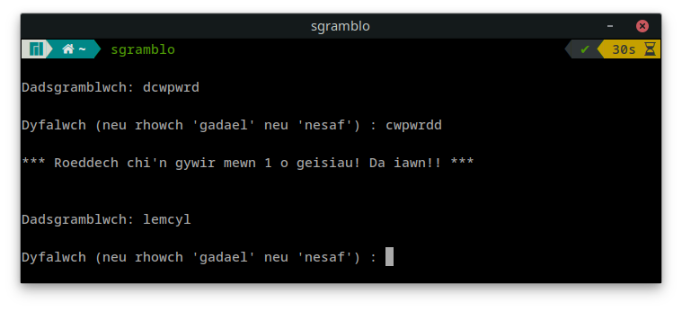

# sgramblo
Gêm a grëwyd yn bash yn seiliedig ar god o lyfr 'Bash Cookbook' O'Reilly Media, Inc., 2017.

Rhowch y sgriptiau rhywle y gallwch call a'u gwneud yn weithredadwy

```console
mv -t /usr/local/bin sgramblo llinellhap
chmod +x /usr/local/bin/sgramblo /usr/local/bin/llinellhap
```
A rhowch y rhestr o eiriau i le call

```console
mv geiriau.txt /usr/lib/geiriau.txt

Yna gallwch chwarae'r gêm drwy redeg y gorchymyn sgramblo

```console
sgramblo
```

